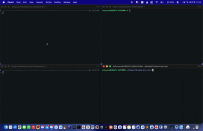

### Demo

왼쪽 터미널은 Mac(Victim)이고, 오른쪽 터미널은 같은 네트워크에 있는 Linux(Attacker)에 SSH로 연결한 모습입니다. Attacker가 send-arp를 실행하면 Victim의 ARP 테이블이 변조되어 ping이 끊기고, tcpdump에서 Victim의 ICMP 패킷이 잡히는 것을 확인할 수 있습니다. (와이서 샤크 말고 tcpdump를 이용하여 패킷이 잡히는 것을 확인했습니다.)

mp4가 readme.md에 넣는다고 바로 보이지가 않아서 gif로 변환해서 넣습니다. 원본은 [./send-arp-demo.mov](./send-arp-demo.mov) 에서 볼 수 있습니다.
